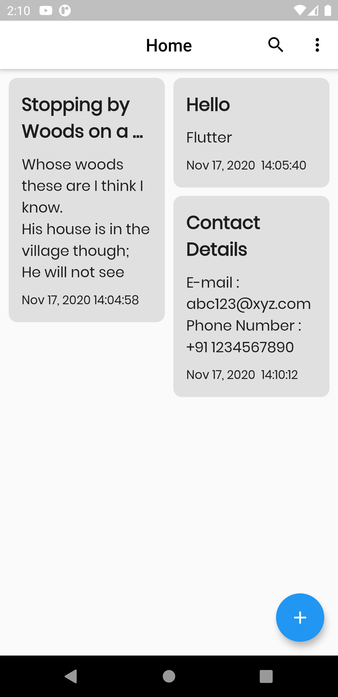
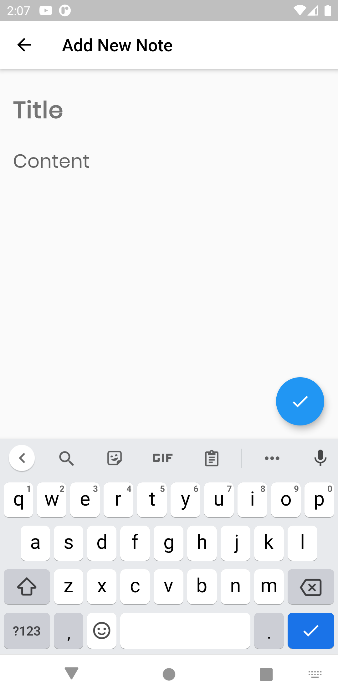
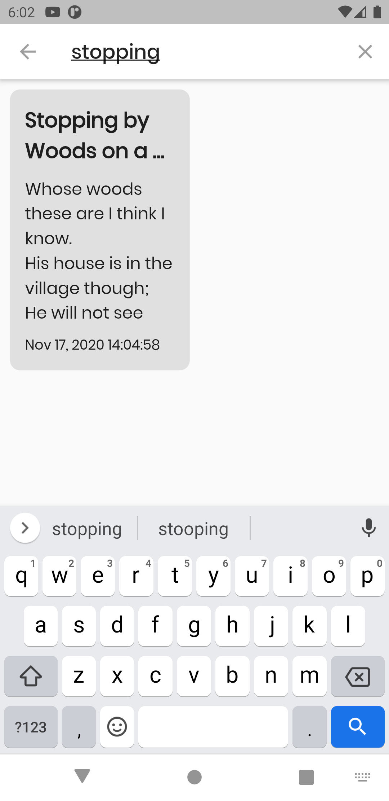
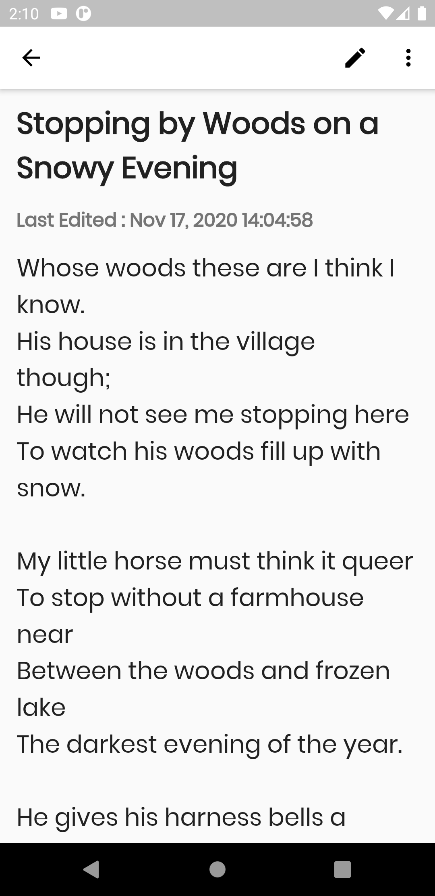
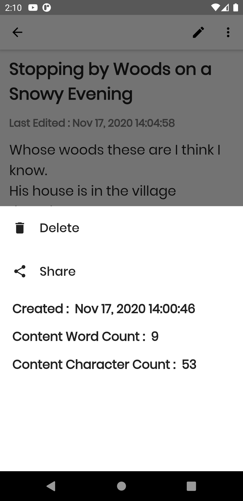
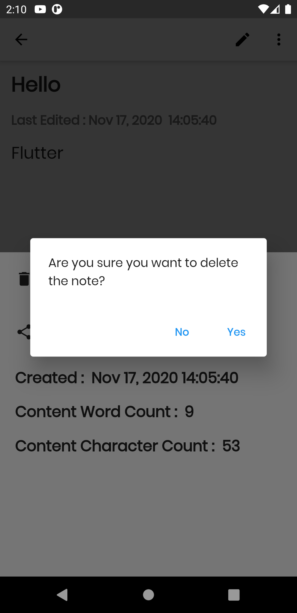

# Notes
A simple note taking app built with Google's Flutter Framework.

## Dependencies
 * get: ^3.17.1
 * sqflite: ^1.3.2+1
 * path_provider: ^1.6.24
 * intl: ^0.16.1
 * google_fonts: ^1.1.1
 * flutter_staggered_grid_view: ^0.3.2
 * share: ^0.6.5+4
 * string_stats: ^0.0.2+2

## Screenshots
<table>
  <tr>
	<td></td>
    <td></td>
	<td></td>
  </tr>
  <tr>
	<td></td>
	<td></td>
	<td></td>
  </tr>
</table>